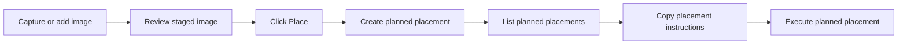

# Image Notebook Quickstart

Use this when you want the shortest path from an image idea to a planned image
placement.

The image notebook is where the tool tracks possible images, why you need them,
where they should go, and what should happen next.

Current side-effect boundary: copying placement instructions is still available
as a dry handoff. The guarded execute command asks before it moves files, edits
your draft, commits and pushes Git changes, or marks the image fully placed.

## Setup

1. Ask Codex to start the image notebook service, or point VS Code at an already
   running one.
2. Set `oatImages.ledgerApiUrl` in VS Code. For local development, use
   `http://127.0.0.1:8787`.
3. Optionally set `oatImages.ledgerApiToken`.
4. Install the D1 image capture bookmarklet from
   [../tools/bookmarklet/README.md](../tools/bookmarklet/README.md) if you want
   one-click web capture outside VS Code.
5. Optionally set `oatImages.imagesRepoPath`; otherwise the prepare command uses
   `~/dev/images`.
6. Open the target markdown draft in VS Code.

## The Short Flow

## Seven Frames

Frame 1: Add an image to the notebook.

- For one-click browser capture, click the OAT D1 image capture bookmarklet.
- For a web image, run `OAT Images: Intake URL`.
- For a local image, run `OAT Images: Intake Local File`.
- For a late-review visual gap, run `OAT Images: Create Review Image Need`.

Frame 2: Open the staging panel.

- Open the `OAT Image Staging` activity bar view.
- Run `OAT Images: Refresh Image Panel` if the panel looks stale.
- With `oatImages.ledgerApiUrl` set, the panel reads staged images from the
  notebook.

Frame 3: Plan a placement.

- Open the target markdown draft.
- In the image panel, click `Place` on a staged image.
- Pick `substack`, `carousel`, or `linkedin-post`.
- Enter the figure number or handoff label.

Frame 4: Confirm the planned work exists.

- Run `OAT Images: List Planned Image Placements`.
- Pick a placement to copy its notebook record if you want to inspect it.

Frame 5: Copy placement instructions.

- Run `OAT Images: Prepare Planned Placement Run`.
- Pick the planned placement.
- The command copies placement instructions to the clipboard.

Frame 6: Know what the instructions are for.

The copied instructions are for the next automation step. They include:

- where the image repo lives
- which image to place
- where it should go
- which planned placement should be updated
- whether the automation should download and commit the image

Frame 7: Execute when ready.

The safe stopping point is the copied JSON from `Prepare Planned Placement Run`.
When you are ready for local side effects, run
`OAT Images: Execute Planned Placement Run`. It confirms before writing asset
files, committing and pushing them, inserting or replacing the draft snippet, and
marking the placement as done.

## Most Common Path

1. Run `OAT Images: Intake URL`.
2. Open `OAT Image Staging`.
3. Click `Place` on the staged image.
4. Run `OAT Images: Prepare Planned Placement Run`.
5. Run `OAT Images: Execute Planned Placement Run` when the draft is open and
   you are ready to write files and update the ledger.

## Command Cheat Sheet

| Goal | Command |
|------|---------|
| Capture a browser image | D1 image capture bookmarklet in `tools/bookmarklet` |
| Add a web image | `OAT Images: Intake URL` |
| Add a local image | `OAT Images: Intake Local File` |
| Record a late visual gap | `OAT Images: Create Review Image Need` |
| Refresh the panel | `OAT Images: Refresh Image Panel` |
| See open needs | `OAT Images: List Open Image Needs` |
| See staged images | `OAT Images: List Staged Notebook Images` |
| See planned placements | `OAT Images: List Planned Image Placements` |
| Copy placement instructions | `OAT Images: Prepare Planned Placement Run` |
| Place image locally | `OAT Images: Execute Planned Placement Run` |

## If Something Feels Off

- No staged assets: confirm `oatImages.ledgerApiUrl` is set and the notebook
  service is running.
- Prepare command has no placements: click `Place` on a staged image first.
- Placement instructions have the wrong repo path: set
  `oatImages.imagesRepoPath`.

## Technical Translation

- Image notebook = the human-facing image ledger.
- The publishing ledger is backed by Cloudflare D1 in this stack.
- The notebook service is the ledger Worker.
- The browser bookmarklet posts to the ledger Worker at `POST /captures/image`;
  it does not write to Google Sheets.
- The ledger Worker can use optional `UNSPLASH_ACCESS_KEY` and
  `PEXELS_ACCESS_KEY` secrets to enrich captured photographer metadata.
- Local development can run through `npm run ledger:dev:node` when Wrangler's
  local D1 runtime is unavailable.
- Placement instructions are JSON shaped for `imagePipeline.placeAsset`.
- The execute command runs `imagePipeline.placeAsset` through the ledger Worker
  lifecycle endpoints.

## Where To Read More

- [use-cases.md](use-cases.md) explains the workflows in more detail.
- [image-pipeline-architecture.md](image-pipeline-architecture.md) explains the
  data model, saga, and repo boundaries.
- [../tools/d1/README.md](../tools/d1/README.md) explains the Cloudflare D1
  Worker setup.
